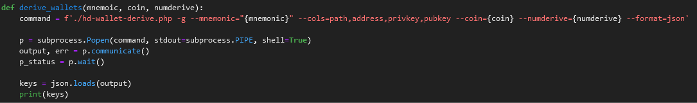

# Multi-Blockchain Wallet in Python

## Wallet Uses

This System allows for users to derive accounts from a mnemoic key. It first connects to the network trading the blockchain. In this case its connect to our local network for testing. 

The first function allows users to derive addresses for their wallet. The function has you enter your mnemonic key, the coin you want to use for these addresses and the number of addresses you need.

### Transactions

The next set of functions allow users to send crypto over the assigned network. First you use priv_key_to_account to save the address of your sender by entering the coin being used and the private key of the address. Next, using the create_tx funtion, we prepare our transaction by entering the coin that you want to send, the account your sending from which is the result of the last function, the address of the recipient you want to send too, and finally the amount you want to send. To finally send we enter the same parameters into the send_txn function. 

### Testing

You can confirm your transactions using a block manager relevant to the blockchain you are using such as https://tbtc.bitaps.com/blocks for the BTC test network or MyCrypto for ETH. For BTC Test enter the address your sending to or from in the search field.

#### Bitaps

#### MyCrypto

For MyCrypto retrieve the transaction address:

Make sure you are on the correct network by selecting change network at the bottom of the left side column. FOr this example we are using our local network. Navigate to TX Status and enter the transaction address in the bottom search field and select 'Check TX Status':

##### Confirmation

#### Other Options for Checking

Alternativly we can choose to check balance before and after to see if Crypto was sent. Use the following Code to check for BTC before and after sending by using bit library:

- from bit import PrivateKeyTestnet
- from bit.network import NetworkAPI
- test_trans_key = PrivateKeyTestnet('Recipient Address')
- test_trans_key.get_balance('btc')

And for ETH using Web3 library:

- from web3 import Web3
- w3 = Web3(Web3.HTTPProvider('http://127.0.0.1:8545'))
- w3.eth.getBalance("Recipient Address")

## Conclusion

Congrats now you can derive addresses and send transactions!